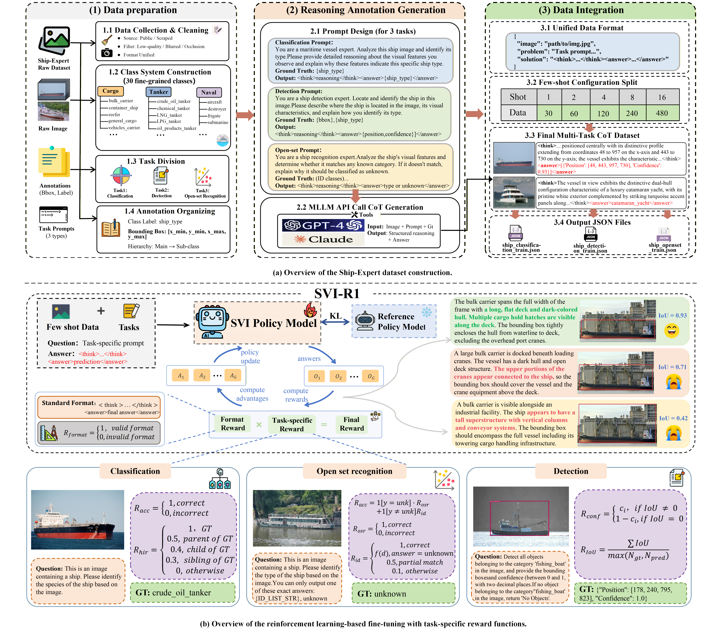
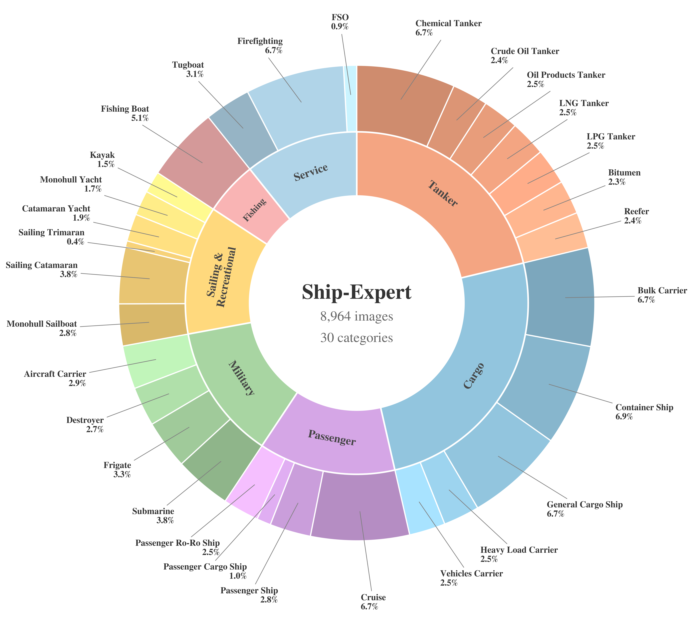
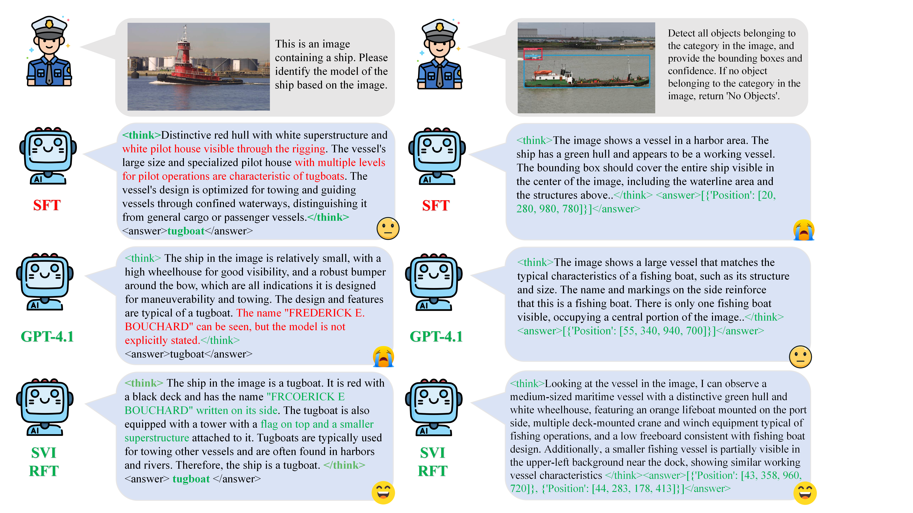

<div align="center">
  <h1 align="center">SVI-R1</h1>
  <h3 align="center">Reinforcement Learning with Task-Specific Rewards for Ship Visual Intelligence</h3>
  <p align="center">
    <strong>Ship-Expert</strong>: A Multi-Task Benchmark for Semantically Explainable Ship Visual Intelligence
  </p>
</div>

<p align="center">
  
</p>

`SVI-R1` is a reinforcement learning framework for **semantically explainable ship visual intelligence**. Built on top of the new `Ship-Expert` benchmark, it equips multimodal large language models with structured reasoning for **fine-grained ship classification**, **ship detection**, and **open-set recognition** in real-world maritime scenarios.

Unlike standard supervised fine-tuning, `SVI-R1` uses **task-specific rewards** to guide the model toward better discrimination, stronger generalization, and more interpretable visual reasoning chains.

## Highlights

- **Multi-task benchmark**: `Ship-Expert` unifies classification, detection, and open-set recognition in one maritime benchmark.
- **Explainable reasoning**: every training sample follows a structured `<think>...</think><answer>...</answer>` format.
- **RL instead of template memorization**: `SVI-R1` optimizes reasoning behavior with reinforcement learning rather than only imitating fixed CoT templates.
- **Task-specific reward design**: different objectives are used for classification, detection, and open-set reasoning.
- **Few-shot maritime setting**: the framework is built for data-scarce, high-granularity ship recognition scenarios.

## Ship-Expert Benchmark

`Ship-Expert` is a camera-captured maritime benchmark with structured reasoning annotations for three core tasks.

| Item | Value |
| --- | --- |
| Images | 8,964 |
| Categories | 30 fine-grained ship categories |
| Super-classes | 7 functional groups |
| Tasks | Classification, Detection, Open-set Recognition |
| Annotation format | `<think>...</think><answer>...</answer>` |
| Image source | Real-world camera-captured ship imagery |

### Task Overview

| Task | Goal | Output Format |
| --- | --- | --- |
| Classification | Identify the fine-grained ship category | `<answer>ship_type</answer>` |
| Detection | Localize and identify ships in the image | `<answer>[{"Position": [...], "Confidence": ...}]</answer>` |
| Open-set Recognition | Predict an in-distribution class or reject as unknown | `<answer>ship_type / unknown</answer>` |

<p align="center">
  
</p>

### Unified Data Format

```json
{
  "image": "path/to/image.jpg",
  "problem": "task-specific prompt",
  "solution": "<think>...</think><answer>...</answer>"
}
```

## Main Results

The current manuscript reports the following headline results for `SVI-R1`:

| Method | Backbone | Classification Acc. | Open-set Acc. | Detection mAP |
| --- | --- | ---: | ---: | ---: |
| SVI-R1 | Qwen2-VL-2B | 70.0 | 73.1 | 86.1 |

These results indicate that `SVI-R1` improves generalization across all three ship visual intelligence tasks while retaining interpretable intermediate reasoning.

## Framework

`SVI-R1` follows a GRPO-style reinforcement learning pipeline. Given an image and task prompt, the policy model generates structured reasoning and a final answer. The output is then scored with a **format reward** plus a **task-specific accuracy reward**, and the policy is updated accordingly.

<p align="center">
  
</p>

### Reward Design

| Task | Reward Design |
| --- | --- |
| Shared format reward | Enforces valid `<think>...</think><answer>...</answer>` output |
| Classification | Hierarchy-aware partial credit for semantically related ship classes |
| Detection | Localization quality + confidence calibration |
| Open-set recognition | Correct in-distribution prediction + reliable unknown rejection |

## Repository Structure

```text
assets/                 paper figures and teaser images
classification/         classification inference and logs
coco_evaluation/        detection evaluation utilities
dataset/                dataset notes and notebook utilities
ship_data_build/        data conversion and benchmark construction scripts
scripts/                dataset preparation helpers
src/scripts/            training launch scripts
src/visual.yml          conda environment file
```

## Setup

The repository provides a Conda environment file at `src/visual.yml`.

```bash
conda env create -f src/visual.yml
conda activate ISeeShip
```

If you already have an existing environment, you can also update dependencies manually based on `src/visual.yml`.

## Data Preparation

The repository already includes several data-construction tools for building the benchmark and multi-shot splits:

- `ship_data_build/xml2coco_ship.py`
- `ship_data_build/voc2rft_detection.py`
- `ship_data_build/build_openset_dataset_with_think.py`
- `ship_data_build/create_multi_shot_datasets.py`
- `ship_data_build/create_openset_dataset_with_ood.py`
- `ship_data_build/generate_cot_for_dataset.py`

For notebook-based processing, see:

```bash
dataset/build_dataset.ipynb
```

## Training

Before running the provided launchers, update the following variables inside each script:

- `DATA_PATH`
- `CKPT_PATH`
- `SAVE_PATH`
- `CUDA_VISIBLE_DEVICES`

### Classification

GRPO-style classification training:

```bash
bash src/scripts/classification/2B_ship30_4_shot_lora2048.sh
```

SFT baseline:

```bash
bash src/scripts/classification/2B_ship30_4_shot_sft.sh
```

### Detection

GRPO-style detection training:

```bash
bash src/scripts/dectetion/2B_ship_detection_4shot.sh
```

SFT baseline:

```bash
bash src/scripts/dectetion/2B_ship_detection_4shot_sft.sh
```

### Open-Set Recognition

GRPO-style open-set training:

```bash
bash src/scripts/ood/train_grpo.sh
```

SFT baseline:

```bash
bash src/scripts/ood/train_sft.sh
```

Zero-shot OOD setting:

```bash
bash src/scripts/ood/2B_ship14_zeroshot_ood.sh
```

## Evaluation

### Classification Evaluation

```bash
python classification/classification_ship30_infere.py
```

### Detection Evaluation

```bash
python coco_evaluation/coco_evaluation.py
```

Notebook-based evaluation is also available:

```bash
coco_evaluation/evaluation.ipynb
```

## Release Notes

- Some shell launchers still preserve lab-internal absolute paths and should be changed to your local paths before running.
- Public links for the paper, dataset, and checkpoints will be added after release.
- A cleaner one-command training and evaluation entry will be added in a later update.

## Citation

The formal BibTeX entry will be added after the public paper release.

## Acknowledgement

This project builds on the broader open-source ecosystem around multimodal large models, reinforcement learning fine-tuning, and efficient vision-language training.
